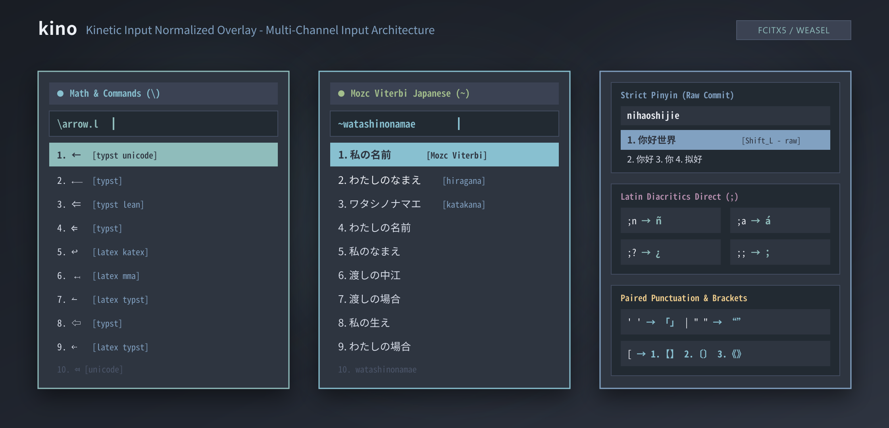

# kino

[简体中文](README.md) | [English](README.en.md) | [网页文档](https://epistemelody.github.io/rime-kino/)

[](https://www.gnu.org/licenses/gpl-3.0)
[](https://rime.im/download/)
[](https://rime.im/)
[](tests/)

> 支持中文拼音、日文假名与汉字分词（Mozc Viterbi）、拉丁重音、多生态数学符号（LaTeX / Typst / Lean / MMA）及成对标点的多通道 Rime 叠层方案。

kino（读音：`/ˈkiːnoʊ/`，*Kinetic Input Normalized Overlay*）是构建于 [oh-my-rime (薄荷拼音)](https://github.com/Mintimate/oh-my-rime) 之上的多通道 Rime 叠层方案。

方案基于离线 2-gram 倒排索引与 Lua 扩展，在保留全拼输入的基础上，提供多生态数学符号与宏检索（LaTeX / KaTeX / Typst / Lean 4 / Mathematica / Unicode）、日文假名与 Mozc 维特比分词、拉丁重音字符直出、成对标点映射以及长度门控的 Emoji 联想能力。各专用通道通过指定前缀引导符（如 `\`、`;`、`~`）触发。

<p align="center">
  
</p>

---

## 交互速查 (Cheat Sheet)

| 通道 / 模式 | 示例输入 | 输出 | 交互说明 |
| :--- | :--- | :--- | :--- |
| 拼音 | `nihao` / `beijing` | `你好` / `北京` | 禁用模糊音与错位代数；编码扩容至 256 字符；Space 上屏，`1`–`9`、`0` 选词 |
| 中英切换 | 输入中按 `Shift_L` / `Shift_R` | `nihao` | Raw Commit：直接提交当前输入的 ASCII 字符，不污染文本 |
| 顿号 / 数学 | 单按 `\` / `\alpha` / `\int` / `\->` | `、` / `α` / `∫` / `→` | 单按 `\` 输出顿号；4 级计分检索 LaTeX / Typst / Lean / MMA / Unicode 符号并标注来源 |
| Typst | `\arrow.l` / `\prec.eq` | `←` / `⪯` | 点号 `.` 参与检索，不触发翻页 |
| 拉丁重音 | `;n` / `;a` / `;?` / `;;` | `ñ` / `á` / `¿` / `；` | 大小写敏感（`;A` $\to$ `Á`）；双击 `;;` 输出全角分号；单按 `;` 挂起不上屏 |
| 日文 | `~ka` / `~KA` / `~watashiha` / `~-` | `か` / `卡` / `私は` / `ー` | 小写平假名，大写片假名；罗马音 DFA + Mozc 维特比分词；`-` 转换长音 `ー` |
| 独立假名 | `Ctrl+\`` 切换至「假名」 | `ka` $\to$ `か` | 无需 `~` 前缀，直接键入罗马音输出假名 |
| 标点 / 括号 | 连续按 `'` / 连续按 `"` / 按 `[` | `「` 再 `」` / `“` 再 `”` / 选单 | 成对直角引号/双引号状态机；`[` 唤出直角与多重括号选单 |
| Emoji | `xiao` / `pingguo` | `😄` / `🍎` | 基于 CLDR 46 标注；$\ge 3$ 字符门控（消除 1~2 字高频汉字的表情干扰） |
| 实用工具 | `=128*1024` / `N20260827` / `Uw` | `131072` / 农历 / 五笔反查 | 支持计算器、公历转农历、五笔/拆字/Unicode 反查 |
| 方案 / 开关 | `Ctrl+\`` | `kino` / `假名` | 呼出方案选单；支持独立切换 8 组 Feature Flags 并自动持久化 |

---

## 快速上手 (Quickstart)

<details>
<summary>前置依赖与环境准备 (Prerequisites)</summary>

在部署 kino 叠层前，请确保系统已安装基础运行依赖：

- Python 3.9+ 与 Git
- Rime 输入法前端，且必须具备 librime-lua 运行时扩展支持：

### 1. Linux (Fcitx5 架构)
- 软件包依赖（根据所用发行版选择安装命令）：
  ```bash
  # Fedora / RHEL
  sudo dnf install -y fcitx5 fcitx5-rime librime-lua fcitx5-configtool python3

  # Arch Linux / Manjaro
  sudo pacman -S --needed fcitx5 fcitx5-rime librime-lua fcitx5-configtool python

  # Debian / Ubuntu (>= 24.04)
  sudo apt update && sudo apt install -y fcitx5 fcitx5-rime librime-plugin-lua fcitx5-config-qt python3

  # openSUSE (Tumbleweed / Leap)
  sudo zypper install -y fcitx5 fcitx5-rime librime-lua fcitx5-config-tool python3
  ```
- 系统环境变量：将以下内容写入 `~/.config/environment.d/fcitx5.conf`（Wayland/systemd 环境）或 `~/.xprofile`（X11 环境）后注销重新登录：
  ```ini
  GTK_IM_MODULE=fcitx
  QT_IM_MODULE=fcitx
  XMODIFIERS=@im=fcitx
  ```
- 添加输入法：打开 `fcitx5-configtool`，在输入法列表中添加中州韵 (Rime)。

### 2. Windows (小狼毫 Weasel)
- 从 [Rime 官方下载页](https://rime.im/download/) 或 [Weasel Releases](https://github.com/rime/weasel/releases) 获取并安装小狼毫安装包（推荐 0.16.0+，已内置 librime-lua 运行时）。
- 安装完成后，系统托盘区域将常驻小狼毫服务图标。

### 3. macOS (鼠须管 Squirrel)
- 通过 Homebrew 安装：`brew install --cask squirrel`，或从 [Rime 官方下载页](https://rime.im/download/) / [Squirrel Releases](https://github.com/rime/squirrel/releases) 获取安装包（已内置 librime-lua 运行时）。
- 安装完成后，菜单栏将出现鼠须管图标。

</details>

### 1. 克隆仓库与子模块

部署仅需两个运行时子模块：`oh-my-rime`（拼音底座）与 `Insomnia1437-rime`（日文 Mozc 词库与矩阵）。

```bash
git clone --recurse-submodules --shallow-submodules https://github.com/Epistemelody/rime-kino.git
cd rime-kino
```

> 说明：`--shallow-submodules` 仅拉取当前 pinned 提交。`.gitmodules` 中其他研究参考已配置 `update = none`，不会随 `--recurse-submodules` 拉取。

若已有仓库或未拉取子模块，可执行：

```bash
python3 scripts/init_submodules.py          # 仅拉取运行时子模块 (depth 1)
python3 scripts/init_submodules.py --all    # 拉取全部子模块（含研究参考）
```

### 2. 部署到系统

#### Linux (Fcitx5)
```bash
./scripts/deploy.sh
```
脚本会自动离线预编译码表、同步薄荷拼音底座与 kino 叠层、挂载日文 Mozc 模型、应用 Nord Dark 主题并热重载 Fcitx5-Rime。

#### Windows (小狼毫 Weasel)
```powershell
.\scripts\deploy.ps1
```
执行部署后，在系统托盘右键小狼毫图标，点击「重新部署」。

#### macOS (鼠须管 Squirrel)
```bash
./scripts/deploy.sh
```
执行部署后，点击顶部菜单栏鼠须管图标，选择「重新部署」（用户目录为 `~/Library/Rime`）。

> 进阶提示：部署脚本支持通过 `RIME_DIR`（自定义目标目录）、`FORCE_JP_DICT=1`（强制覆盖日文词库）与 `SKIP_JP_DICT=1`（跳过日文大表）等环境变量调整部署行为，详见 [文档体系与 SSOT 治理规范](docs/README.md)。

---

## 运行期功能开关 (Feature Flags)

方案预设开启 8 组正交功能开关（`kino_latex`、`kino_katex`、`kino_typst`、`kino_lean`、`kino_mma`、`kino_latin`、`kino_japanese` 及 `emoji_suggestion`），可在方案选单（`Ctrl+\``）或状态栏中即时切换，状态自动持久化。各开关的详细定义与快捷键绑定见 [kino 按键交互契约与引擎规范手册](docs/kino.md)。

---

## 常见问题与排错 (FAQ & Troubleshooting)

<details>
<summary>Q1: 为什么输入 <code>\alpha</code> 或 <code>~ka</code> 没有候选词，或提示 Lua 错误？</summary>

- 原因：宿主环境未正确安装或加载 `librime-lua` 运行时插件。
- 解决办法：
  - Linux：检查并确保已安装 `librime-lua`（Ubuntu/Debian 检查 `librime-plugin-lua`）。
  - Windows：请确保小狼毫版本 $\ge 0.16.0$。
  - macOS：请更新鼠须管至最新版本并点击「重新部署」。
</details>

<details>
<summary>Q2: Shift 键切换中英时的具体行为是什么？</summary>

- 解答：
  - 输入缓冲区有编码时：按左/右 `Shift` 触发 Raw Commit，直接将输入的 ASCII 字符上屏。
  - 输入缓冲区为空时：按 `Shift` 切换系统的中/英文输入状态。
</details>

<details>
<summary>Q3: 为什么 <code>/</code> 键不能输入顿号 <code>、</code>？</summary>

- 解答：kino 将顿号映射至 `\` 键（单按 `\` 输出顿号 `、`）。`/` 键用于输入斜杠 `/` 与除号 `÷`。
</details>

<details>
<summary>Q4: 首次输入日文 <code>~</code> 前缀时为什么会有轻微延迟？</summary>

- 解答：kino 采用按需加载机制。日文词库（约 150MB）与转移矩阵仅在首次输入 `~` 时加载至内存。
</details>

<details>
<summary>Q5: 如何自定义数学符号或修改码表数据？</summary>

- 解答：源数据位于 `docs/drafts/*.csv`。修改 CSV 文件后，运行 `python3 scripts/gen_overlay.py` 生成叠层，再运行 `./scripts/deploy.sh` 部署。
</details>

---

## 仓库结构 (Structure)

```
rime-kino/
├── docs/            # 技术规范、交互契约与 CSV 事实源码表 (docs/drafts/)
├── overlay/         # Rime 叠层配置、自定义补丁与 Lua 扩展 (overlay/lua/)
├── platform/        # 平台特定配置与 Nord 主题 (Fcitx5 / Weasel / Squirrel)
├── proj-ref/        # 运行时子模块 (oh-my-rime, Insomnia1437-rime) 与参考源码
├── scripts/         # 离线码表编译器 (gen_overlay.py) 与多平台部署引擎 (deploy.py)
└── tests/           # 自动化回归测试套件 (Pytest)
```

---

## 开发与测试 (Development & Testing)

```bash
# 1. 执行全量码表预编译与 2-gram 倒排索引生成
python3 scripts/gen_overlay.py

# 2. 运行自动化测试套件
pytest tests/ -q
# 72 passed in ~5s
```

---

## 完整文档导航 (Documentation)

- [网页版完整文档](https://epistemelody.github.io/rime-kino/)
- [文档体系与 SSOT 治理规范](docs/README.md) (`docs/README.md`)
- [kino 按键交互契约与引擎规范手册](docs/kino.md) (`docs/kino.md`)
- [码表数据模式、2-Gram 倒排索引与性能规范](docs/drafts/README.md) (`docs/drafts/README.md`)
- [日文 Viterbi 引擎与连接矩阵底层契约](docs/jp-viterbi.md) (`docs/jp-viterbi.md`)
- [数学符号宽表与命令管线规范](docs/math-symbols.md) (`docs/math-symbols.md`)

---

## 路线图 (Roadmap)

- [ ] 常用多语种短语与欧洲语言变音词汇扩展
- [ ] 日文长句输入自适应 Viterbi 本地用户频次缓存
- [ ] 轻量跨平台配置与开关面板 (Web / TUI)

---

## 关联项目与致谢 (Relevant Projects)

- [oh-my-rime (薄荷拼音)](https://github.com/Mintimate/oh-my-rime)：中文拼音基础方案与多词典生态（`proj-ref/oh-my-rime`）。
- [Insomnia1437/rime (カギロイ)](https://github.com/Insomnia1437/rime)：Mozc 日文大词库与 Viterbi 转移矩阵事实源（`proj-ref/Insomnia1437-rime`）。
- [iamcheyan/rime](https://github.com/iamcheyan/rime)：双拼与方案编排参考（`proj-ref/iamcheyan-rime`）。
- [tumuyan/rime-pinyin-jap](https://github.com/tumuyan/rime-pinyin-jap)：拼音日文方案参考（`proj-ref/rime-pinyin-jap`）。
- [gkovacs/rime-spanish](https://github.com/gkovacs/rime-spanish)：拉丁重音 `;` 键位参考（`proj-ref/rime-spanish`）。
- [iDvel/rime-ice](https://github.com/iDvel/rime-ice)：雾凇拼音参考（`proj-ref/rime-ice`）。
- [fkxxyz/rime-cloverpinyin (四叶草拼音)](https://github.com/fkxxyz/rime-cloverpinyin)：拼音习惯与成对标点参考。
- [shenlebantongying/rime_latex](https://github.com/shenlebantongying/rime_latex)：LaTeX 数学符号方案参考。
- `proj-arc/cloverplus`：基于四叶草拼音与 rime_latex 的本地定制归档（历史参考，非运行时代码）。
- [hchunhui/librime-lua](https://github.com/hchunhui/librime-lua)：Rime Lua 运行时引擎。

---

## 许可协议 (License) & 引用 (Citation)

本项目源码基于 [GPL-3.0](https://www.gnu.org/licenses/gpl-3.0) 许可协议开源。

```bibtex
@software{epistemelody2026kino,
  author       = {Felidz and {Epistemelody}},
  title        = {kino: A Modern Table-Driven Multi-Channel Rime Input Overlay Framework},
  year         = {2026},
  publisher    = {GitHub},
  journal      = {GitHub repository},
  howpublished = {\url{https://github.com/Epistemelody/rime-kino}}
}
```
